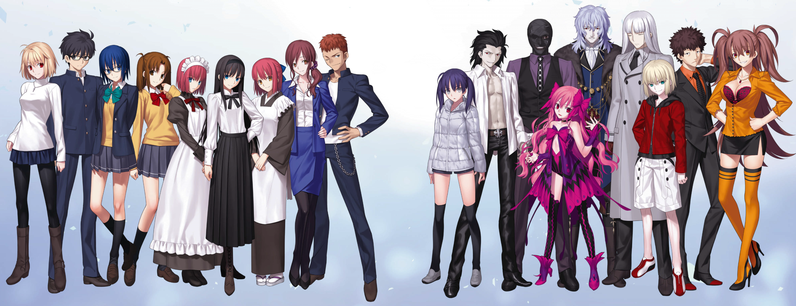
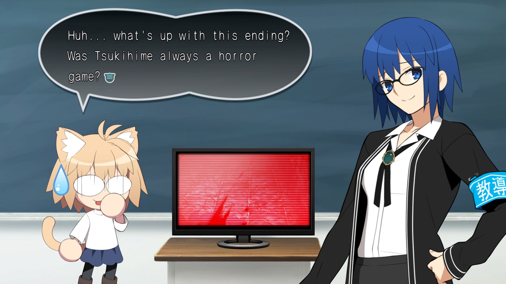
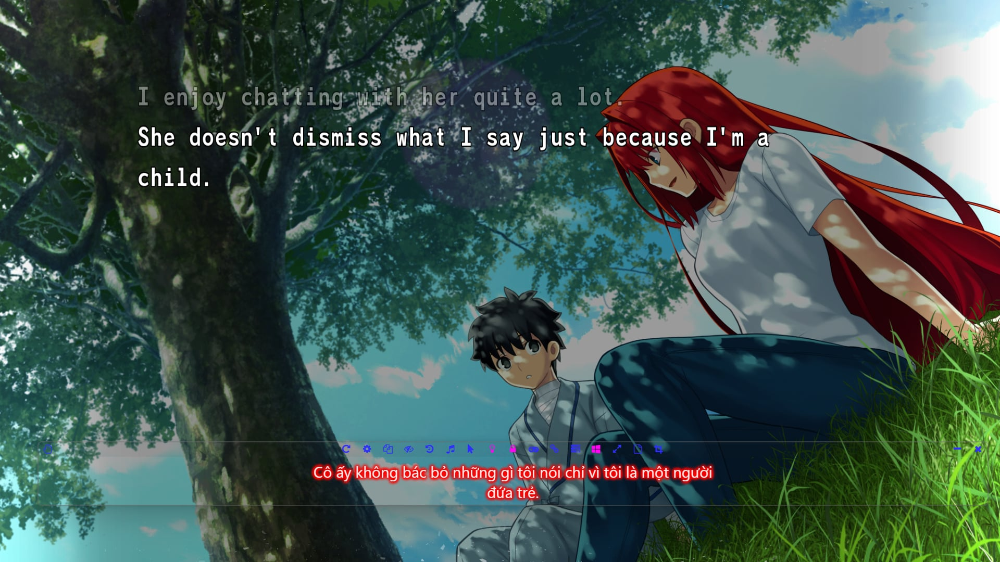

# Thông tin chung về “Tsukihime - under the blue glass moon” 
Tsukihime là một visual novel, ra mắt vào năm 2000, và là visual novel đầu tay của Type-moon. Hiện nay,  Type-moon được biết tới nhiều hơn từ series Fate (Fate/stay night, Fate/zero…), nhưng họ bắt đầu nổi lên nhờ Tsukihime. Chính từ sau thành công của Tsukihime tại comiket những năm 2000, Typemoon mới có đủ nguồn lực để đầu tư thực hiện dự án Fate/stay night. 

Tsukihime (2000) có 5 nhánh truyện (route), khai thác 5 nhân vật khác nhau. Hai route đầu tiên khai thác Arcuied và Ciel. Chúng tập trung vào bí ẩn ma cà rồng trong thành phố và được gọi là "near-side" route. Trái ngược với những cuộc chiến siêu nhiên giữa ma cà rồng, 3 route còn lại hay còn gọi là "far-side" route diễn ra chủ yếu bên trong dinh thự Tohno, mang thiên hướng drama và hé lộ quá khứ u ám của các thành viên trong gia tộc. 

“Tsukihime - under the blue glass moon”  là phiên bản remake của "near-side" route. Không chỉ nâng cấp về hình ảnh, âm thanh, mà phần kịch bản đã có những thay đổi đáng kể với sự xuất hiện của các nhân vật mới và rất nhiều tình tiết được gọt giũa. 

Remake của "Far-side" route cùng với một nhánh truyện hoàn toàn mới được hứa hẹn sẽ xuất hiện trong phần tiếp theo mang tên “Tsukihime - The other side of Red garden”. Tuy nhiên cho đến nay chưa có tin tức gì về phần truyện này. Hình ảnh duy nhất chúng ta có được là một đoạn teaser nho nhỏ ở cuối "blue glass moon". 
# Bối cảnh câu truyện
Phần truyện này tập trung vào bí ẩn những vụ giết người liên hoàn và sự xuất hiện của ma cà rồng khắp thành phố Souya (trong nội đô Tokyo). Vậy nên các bối cảnh cũng khá đa dạng, từ dinh thự nhà Tohno, trường học, công viên, các căn hộ cho tới các con hẻm tối. 

# Các nhân vật trong phần remake (từ trái qua phải)

- Arcueid Brunestud: Công chúa ma cà rồng xinh đẹp, bí ẩn
- Tohno Shiki: Một chàng trai 17 tuổi với khả năng nhìn thấy cái chết của mọi thứ (ở dạng các đường kẻ). Năng lực ấy được gọi là “trực tử ma nhãn” (mystic eye of death perception). Cậu bắt đầu có được nó từ sau một vụ tai nạn nghiêm trọng không rõ nguyên nhân. 
- Ciel: Chị lớp trên thân thiện và luôn giúp đỡ mọi người. Luôn để ý tới Shiki. 
- Satsuki Yumizuka: bạn cùng lớp của Shiki và Inui. Cô thầm thích Shiki từ lâu, ít liên quan tới phần truyện này nhưng Type-moon hé lộ cô sẽ có route riêng trong “Red garden”
- Hisui: người nhỏ tuổi hơn trong cặp hầu gái song sinh tại dinh thự Tohno. Cô mặc đồng phục hầu gái phương Tây và chịu trách nhiệm chăm sóc Shiki. Hisui hành xử khá lạnh lùng và vô cảm, che dấu cảm xúc thật của mình
- Tohno Akiha: em gái của Shiki, và hiện là trưởng của gia tộc Tohno. 
- Kohaku: Chị gái của Hisui. Cô mặc trang phục Kimono và đeo tạp dề chùm lên. Cô có tính cách vui vẻ và luôn tươi cười trái ngược với Hisui. 
- Noel: Cô giáo mới của Shiki. Luôn cợt nhả và đùa dỡn với Shiki. Làm việc cho nhà thờ vào cuối tuần. 
- Arihiko Inui: Bạn thân lâu năm của Shiki và cũng là bạn của Ciel
- Mio Saiki: Một cô gái chạy trốn khỏi nhà. Ít liên quan tới phần truyện này, khả năng sẽ có nhiều thông tin hơn trong ”Red garden”. 
- Michael Roa Valdamjong: Ma cà rồng với khả năng chuyển sinh vô hạn. Sau mỗi lần chết hắn ta chọn một đứa trẻ có trong gia đình có vị thế và năng khiếu phép thuật để chuyển sinh. Đối tượng được chọn có một cuộc sống như người thường và chỉ chuyển hóa thành Michael khi trưởng thành. Điều này khiến cho việc truy lùng hắn ta cực kì khó khăn và khi phát hiện thì có thể đã quá muộn. 
- Goto Saiki: Một nhân vật bí ấn thi thoảng xuất hiện trong dinh thự. Anh ta quấn băng gạc đen kín người. 
- Loli váy hồng: Một nhân vật bí ẩn khác đóng vai trò quan trọng trong Ciel route. 
- Vlov Arkhangel: Ma cà rồng từ xứ lạnh phương Bắc tình cờ xuất hiện tại thành phố. 
- Karius Berlusconi: cận vệ của Mario
- Mario Gallo Bestino: Vẻ ngoài của một thanh niên 13 tuổi, cậu được hội nhà thờ cử để xử lý những vụ việc gần đây
- Yuugo Ando: cận vệ của Mario, tay trong của hội nhà thờ trong cơ quan cảnh sát
- Dr. Arach: Bạn đại học của Makihisa Tohno, người hiện tại là bác sĩ gia đình nhà Tohno và là cố vấn cho Akiha 
## Nhân vật khác
- Aozaki Aoko: Người phụ nữ tóc đỏ bí ẩn luôn mang theo chiếc va li. Cô gặp Shiki 7 năm trước khi câu chuyện trong trò chơi bắt đầu và tặng Shiki một chiếc kính có thể che dấu các “đường chết” mang lại cuộc sống bình thường cho Shiki.  
- Makihisa Tohno: Bố của Akiha và Shiki, là trưởng gia tộc. Ông mất ngay trước khi câu truyện bắt đầu, trao vị trí đó cho Akiha. Không có hình ảnh, nhưng được đề cập tới. Vai trò của ông sẽ được hé lộ rõ hơn trong "red-garden"

Một số lựa chọn trong câu truyện sẽ dẫn tới cái chết của nhân vật chính. Lúc này người chơi sẽ được dẫn vào góc "teach me CIel sensei" (dạy em với cô Ciel ơi). Một phân đoạn hài hước cùng hai nhân vật Neko-Arc và Ciel-sensei. 

- Neko-Arc: Bắt đầu là một phiên bản parody của Arcueid, dần dần trở thành mascot của Type-moon. Danh tiến của Neko-Arc còn vượt ra ngoài, thậm trí những người không biết đến Type-moon hay Tsukihime cũng biết tới Neko-Arc. 
- Ciel-sensei: Ciel trong trang phục cô giáo. Cô đưa ra những chỉ dẫn hữu ích trong các bad end.
# Một chút về các bản dịch Tsukihime
Năm 2008, những hình ảnh đầu tiên về dự án remake Tsukihime được hé lộ, nhưng chỉ đến năm 2021, “Tsukire” mới được ra mắt với khán giả Nhật và phải 3 năm sau phiên bản quốc tế bao gồm Tiếng Anh và Tiếng Trung mới được phát hành. Một điều rất đáng tiếc là “Tsukire” chỉ phát hành trên 2 nền tảng console là Switch và Playstation, mặc dù tất cả các tựa game khác của Type-moon trong quá khứ và về sau đều có phiên bản PC. Điều này là rào cản lớn với những người muốn chơi tựa game một cách chính thức, vì không phải ai cũng có thể sở hữu một hệ máy console và mua game với giá đắt hơn trung bình so với game PC. 

Trong khi chờ đợi thông tin về phiên bản quốc tế, hàng loạt các dự án dịch game sang các ngôn ngữ khác nhau đã được khởi xướng bởi những người yêu Tsukihime toàn cầu. Nổi tiếng nhất đó là dự án dịch [Tsukimates](https://tsukihimates.com/) (Tiếng Anh) hoàn thành vào tháng 9/2023. Về tốc độ hoàn thiện thì phải nói tới phiên bản Hàn Quốc. Họ hoàn thành bản machine-translated (máy dịch) 2 ngày sau khi bản gốc ra mắt và phiên bản người dịch chỉ sau 1 tháng.  Sau đó các phiên bản Tiếng Trung, Tiếng Anh, Tiếng Nga, Tiếng Tây Ban Nha, Tiếng Bồ Đào Nha (Brazil) lần lượt được ra mắt. Hi vọng trong tương lai các nhóm dịch và nhà phát hành sẽ mang Tsukihime tới nhiều nước hơn nữa trong đó có Việt Nam. 

Các bản dịch của cộng đồng làm đều hoạt động tương tự nhau. Nó yêu cầu người chơi phải sử dụng phần mềm giả lập Nintendo Switch, và vá bản dịch vào (patch). Điều này là bởi vì các hệ máy Switch, PS không cho phép chạm vào file game. Bản thân việc sử dụng phần mềm giả lập Switch cũng là điều gây tranh cãi, mặc dù bản thân việc giả lập là không phạm pháp. Nhưng Nintendo liên tục gây sức ép tới các lập trình viên cộng đồng để chấm dứt những dự án này. Rất nhiều dự án cũng đã phải dừng lại, đổi tên hoặc di rời code sang nơi khác. Vậy nên việc sử dụng phần mềm giả lập switch không đơn giản là bấm vào kết quả trang nhất trên google rồi tải xuống, làm như vậy có thể khiến máy bạn nhiễm virus. Mặc dù vậy, nếu đủ kiên nhẫn và chịu khó mò các forum khác nhau hoàn toàn có thể tìm ra được.

Vấn đề lớn hơn nữa tìm kiếm ROM (file dữ liệu game). Quy trình “không vi phạm pháp luật” sẽ là mua thẻ game vật lý, sau đó chép (rip) ROM vào máy tính, rồi sử dụng phần mềm giả lập để cài patch và chơi. Một cách đơn giản hơn đó là tải ROM đã chép của người khác chia sẻ trên mạng. Tất nhiên chia sẻ game là vi phạm bản quyền nên không được khuyến khích 🐧🐧🐧. 
# Chơi game bằng Tiếng Việt
Mặc dù chưa có bản dịch cộng đồng cũng như chính thức cho Tsukihime. Người dùng vẫn có thể sử dụng phần mềm dịch để chơi game. Việc này chắc chắn là có nhiều hạn chế và đòi hỏi mày mò hơn. Sử dụng [Lunar Translator (Trang Tiếng Việt)](https://docs.lunatranslator.org/vi/) và trình giả lập Citron. Có rất nhiều trình giả lập khác nhau nhưng hiện nay chỉ có Citron là hoạt động với Lunar Translator. Kết quả sẽ giống như thế này. 

Ở đây mình sử dụng thử Lunar translator với bản dịch Tsukimates. Tất nhiên nếu bạn biết Tiếng Anh hoặc tốt hơn nữa là Tiếng Nhật thì không dại gì mà làm vậy. Trớ trêu hơn nữa là những người tiếp cận được với game file, phần mềm giả lập và phiên dịch, biết vá game, thường là biết đọc Tiếng Anh từ trước. Nhưng giả dụ bạn là 1% người đủ hứng thú dùng google dịch để vượt qua các rào cản ngôn ngữ và cuối cùng cùng thu thập đủ các điều kiện để chơi game. Mình khuyến khích sử dụng dịch từ Tiếng Nhật, tránh tình trạng dịch hai lần. Lưu ý là khi mới bật game lên Tsukihime sẽ chơi một đoạn mở đầu khoảng 5 phút. Đoạn này là video nên phần mềm dịch sẽ không thể bắt được chữ, nhưng may mắn đã có bản dịch trên [Youtube](https://www.youtube.com/watch?v=kBY1-hWz0I0). Sau khi đoạn mở đầu kết thúc, chữ sẽ dừng tự chạy và phần mềm lúc này mới có thể bắt được.

Một lưu ý nữa: dự án Citron chính thức dừng lại. Tuy nhiên đây không phải dấu chấm hết cho tất cả. Như nhiều dự án cộng đồng, code của Citron vẫn được lưu lại và phát triển tiếp thành dự án mới[ Citron Neo](https://citron-neo.github.io/#2026-03-20). Cá nhân mình chưa thử xem phiên bản mới này có hoạt động với Lunar translator không, nhưng không có lý do gì cho việc nó không cả. Nhưng nếu nó không hoạt động, hãy thử những phiên bản citron cũ hơn. Chúc các bạn may mắn!!!
