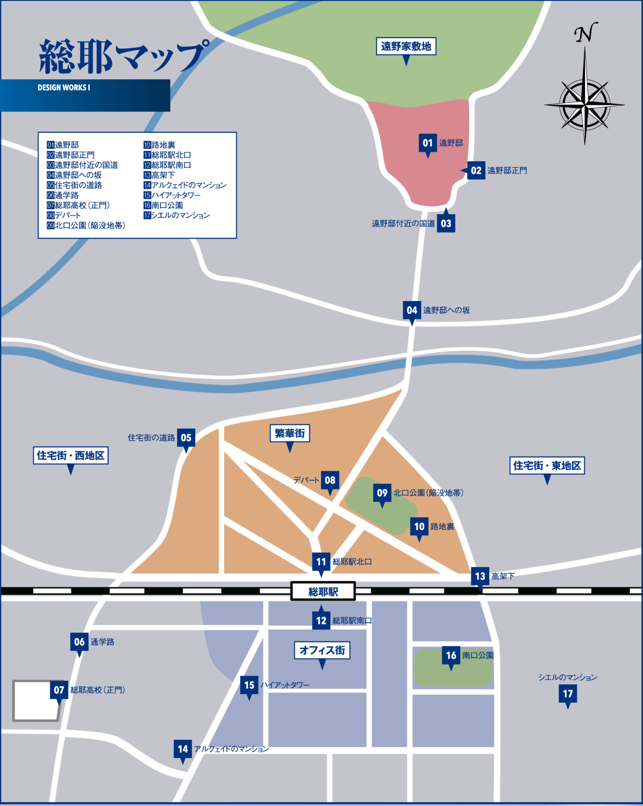

# Thông tin chung về “Tsukihime - under the blue glass moon” 

Tsukihime là một visual novel, ra mắt vào năm 2000, và là visual novel đầu tay của Type-moon. Hiện nay,  Type-moon được biết tới nhiều hơn từ series Fate (Fate/stay night, Fate/zero…), nhưng họ bắt đầu nổi lên nhờ Tsukihime. Chính từ sau thành công của Tsukihime tại comiket những năm 2000, Typemoon mới có thể đầu tư thực hiện dự án Fate/stay night. 

“Tsukihime - under the blue glass moon”  hay còn gọi Tsukire là phiên bản remake của Tsukihime(2000). Không chỉ nâng cấp về hình ảnh, âm thanh, mà phần kịch bản đã có những thay đổi đáng kể.  Để so sánh, Tsukihime (2000) bao gồm 5 nhánh truyện (route), nhưng thời gian chơi lại ngắn hơn bản remake trong khi chỉ viết lại 2 nhánh đầu tiên là Arcueid và Ciel. Ba nhánh còn lại trong phần gốc và một nhánh truyện hoàn toàn mới được hứa hẹn sẽ xuất hiện trong phần remake tiếp theo mang tên “Tsukihime -The other side of red garden”. Tuy nhiên, đến nay vẫn chưa có triển vọng gì về ngày ra mắt của “red garden”, mặc dù đã 5 năm kể từ ngày Tsukire ra đời

Ở phần remake này, người chơi sẽ phải chơi các nhánh truyện theo trình tự. Tức là phải xong nhánh Arcueid trước rồi mới được chuyển sang nhánh của Ciel. Nhánh của Arcueid có 1 kết chính, trong khi nhánh của Ciel có 1 kết chính (true end) và một kết phụ (normal end). 
# Bối cảnh câu truyện
Phần truyện này tập trung vào bí ẩn những vụ giết người liên hoàn và sự xuất hiện của ma cà rồng khắp thành phố Souya (trong nội đô Tokyo). Vậy nên các bối cảnh cũng khá đa dạng, từ dinh thự nhà Tohno, trường học, công viên, các căn hộ cho tới các con hẻm tối. 

1. 遠野邸: Dinh thự Tohno
2. 遠野邸正門: Cổng chính dinh thự Tohno
3. 遠野邸付近の国道: Đường lớn gần dinh thự Tohno
4. 遠野邸への坂: Con dốc dẫn lên dinh thự Tohno
5. 住宅街の道路: Đường đi trong khu dân cư
6. 通学路: Đường đến trường
7. 総耶高校(正門): Cổng chính trường Trung học Souya
8. デパート: Trung tâm thương mại / Cửa hàng bách hóa
9. 北口公園 (陥没地跡): Công viên Cửa Bắc (Di tích khu vực hố sụt lún)
10. 路地裏: Những con hẻm / Ngõ vắng
11. 総耶駅北口: Cửa Bắc ga Souya
12. 総耶駅南口: Cửa Nam ga Souya
13. 高架下: Gầm cầu vượt
14. アルクのマンション: Căn hộ của Arc (Arcueid)
15. ハイアットタワー: Tháp Hyatt
16. 南口公園: Công viên Cửa Nam
17. シエルのマンション: Căn hộ của Ciel

# Các nhân vật trong phần remake 
## Nhân vật chính
- Tohno Shiki: Một chàng trai 17 tuổi với khả năng nhìn thấy cái chết của mọi thứ (ở dạng các đường kẻ). Năng lực ấy được gọi là “trực tử ma nhãn” (mystic eye of death perception). Cậu bắt đầu có được nó từ sau một vụ tai nạn nghiêm trọng không rõ nguyên nhân. 
- Arcueid Brunestud: Công chúa ma cà rồng xinh đẹp, bí ẩn
- Ciel: Chị lớp trên thân thiện và luôn giúp đỡ mọi người. Luôn để ý tới Shiki. 
- Noel: Cô giáo mới của Shiki. Luôn cợt nhả và đùa dỡn với Shiki. Làm việc cho hội Công giáo mỗi cuối tuần. 
## Gia đình Tohno
- Tohno Akiha: em gái của Shiki, và hiện là trưởng của gia tộc Tohno. 
- Hisui: người nhỏ tuổi hơn trong cặp hầu gái song sinh tại dinh thự Tohno. Cô mặc đồng phục hầu gái phương Tây và chịu trách nhiệm chăm sóc Shiki. Hisui hành xử khá lạnh lùng và vô cảm, che dấu cảm xúc thật của mình
- Kohaku: Chị gái của Hisui. Cô mặc trang phục Kimono. Cô luôn luôn tươi cười và vui vẻ. 
- Makihisa Tohno: Bố của Akiha và Shiki, là trưởng gia tộc. Ông mất ngay trước khi câu truyện bắt đầu, trao vị trí đó cho Akiha. 
- Goto Saiki: Một nhân vật bí ấn thi thoảng xuất hiện trong dinh thự. Anh ta quấn băng gạc kín người. 
- Dr. Arach: Bạn đại học của Makihisa Tohno, người hiện tại là bác sĩ gia đình nhà Tohno và là cố vấn cho Akiha 
## Ma cà rồng
- Vlov Arkhangel: Một ma cà rồng từ xứ lạnh phương Bắc tình cờ xuất hiện tại thành phố. 
- Michael Roa Valdamjong: Ma cà rồng với khả năng chuyển sinh vô hạn. Sau mỗi lần chết hắn ta chọn một đứa trẻ có trong gia đình có vị thế và năng khiếu phép thuật để chuyển sinh. Đối tượng được chọn có một cuộc sống như người thường và chỉ chuyển hóa thành Michael khi trưởng thành. Điều này khiến cho việc truy lùng hắn ta cực kì khó khăn và khi phát hiện thì có thể đã quá muộn. 
## Nhân vật khác
- Aozaki Aoko: Người phụ nữ tóc đỏ bí ẩn luôn mang theo chiếc va li. Cô gặp Shiki 7 năm trước khi câu chuyện trong trò chơi bắt đầu và tặng Shiki một chiếc kính có thể che dấu các “đường chết” và từ đó Shiki có thể có được cuộc sống bình thường. 
- Satsuki Yumizuka: bạn học của Shiki. Cô thầm thích Shiki từ lâu, ít liên quan tới phần truyện này nhưng Type-moon hé lộ cô sẽ có route riêng trong “red garden”
- Mio Saiki: Một cô gái chạy trốn khỏi nhà. Ít liên quan tới phần truyện này, khả năng sẽ có nhiều thông tin hơn trong ”red-garden”. 
- Arihiko Inui: Bạn thân lâu năm của Shiki và cũng là bạn của Ciel
- Mario Gallo Bestino: Được hội công giáo cử để xử lý những vụ việc gần đây
- Yuugo Ando và Karius Berlusconi: 2 cận vệ của Mario
## Bộ đôi tấu hài
- Ciel sensei: Ciel trong trang phục cô giáo. Đồng hành cùng người chơi trong phần “teach me Ciel-sensei” (dạy em với cô Ciel ơi) để giải đáp thêm các thông tin về những dead end 
- Neco-Arc: Đồng hành cùng Ciel-sensei. Là nhân vật Mascot của Type-moon, bắt đầu là một phiên bản parody của Arcueid, dần dần sự nổi tiếng Neco-Arc biến nó trở thành một giống loài riêng. 
# Một chút về các bản dịch Tsukihime

Năm 2008, những hình ảnh đầu tiên về dự án remake Tsukihime được hé lộ, nhưng chỉ đến năm 2021, “Tsukire” mới được ra mắt với khán giả Nhật và phải 3 năm sau phiên bản quốc tế bao gồm Tiếng Anh và Tiếng Trung mới được phát hành. Một điều rất đáng tiếc là “Tsukire” chỉ phát hành trên 2 nền tảng console là Switch và Playstation, mặc dù tất cả các tựa game khác của Type-moon trong quá khứ và về sau đều có phiên bản PC. Điều này là rào cản lớn với những người muốn chơi tựa game một cách chính thức, vì không phải ai cũng có thể sở hữu một hệ máy console và mua game với giá đắt hơn trung bình so với game PC. 

Trong khi chờ đợi thông tin về phiên bản quốc tế, hàng loạt các dự án dịch game sang các ngôn ngữ khác nhau đã được khởi xướng bởi những người yêu Tsukihime toàn cầu. Nổi tiếng nhất đó là dự án dịch [Tsukimates](https://tsukihimates.com/) (Tiếng Anh) hoàn thành vào tháng 9/2023. Về tốc độ hoàn thiện thì phải nói tới phiên bản Hàn Quốc. Họ hoàn thành bản machine-translated (máy dịch) 2 ngày sau khi bản gốc ra mắt và phiên bản người dịch chỉ sau 1 tháng.  Sau đó các phiên bản Tiếng Trung, Tiếng Anh, Tiếng Nga, Tiếng Tây Ban Nha, Tiếng Bồ Đào Nha (Brazil) lần lượt được ra mắt. Hi vọng trong tương lai các nhóm dịch và nhà phát hành sẽ mang Tsukihime tới nhiều nước hơn nữa trong đó có Việt Nam. 

Các bản dịch của cộng đồng làm đều hoạt động tương tự nhau. Nó yêu cầu người chơi phải sử dụng phần mềm giả lập Nintendo Switch, và cài bản dịch vào (patch). Điều này là bởi vì các hệ máy Switch, PS không cho phép chạm vào file game. Việc giả lập Switch không phải là việc quá khó nhưng sẽ là rào cản lớn đối với nhiều người. Vấn đề lớn hơn nữa tìm kiếm ROM (file dữ liệu game). Quy trình “không vi phạm pháp luật” sẽ là mua thẻ game vật lý, sau đó chép(rip) ROM vào máy tính, rồi sử dụng phần mềm giả lập để cài patch và chơi. Một cách đơn giản hơn đó là tải ROM đã chép của người khác chia sẻ trên mạng. Tất nhiên chia sẻ game là vi phạm bản quyền nên không được khuyến khích 🐧🐧🐧. 

