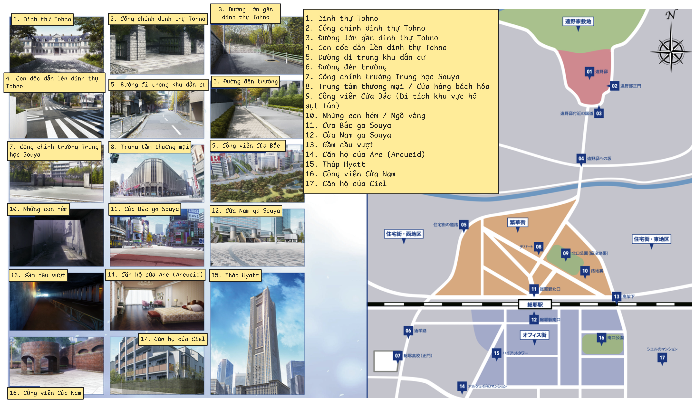
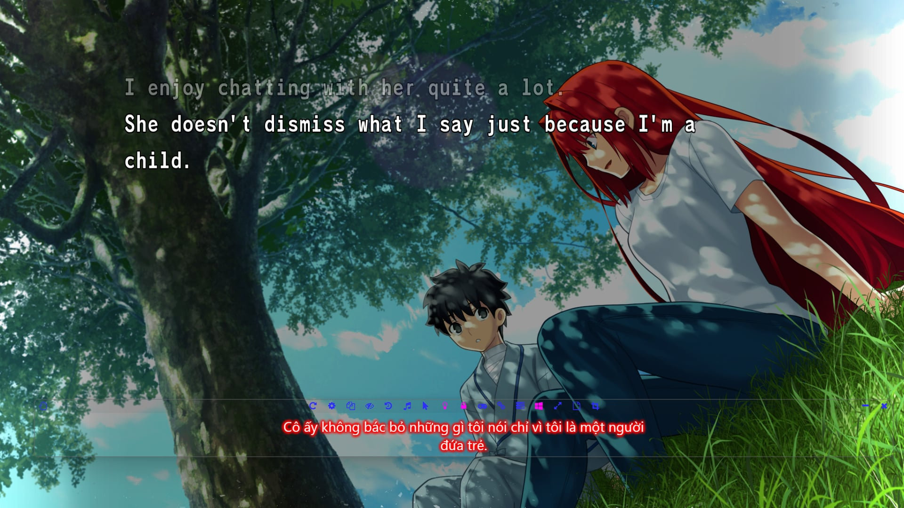

# Thông tin chung về “Tsukihime - under the blue glass moon” 
Tsukihime là một visual novel, ra mắt vào năm 2000, và là visual novel đầu tay của Type-moon. Hiện nay,  Type-moon được biết tới nhiều hơn từ series Fate (Fate/stay night, Fate/zero…), nhưng họ bắt đầu nổi lên nhờ Tsukihime. Chính từ sau thành công của Tsukihime tại comiket những năm 2000, Typemoon mới có đủ nguồn lực để đầu tư thực hiện dự án Fate/stay night. 

Tsukihime (2000) có 5 nhánh truyện (route), khai thác 5 nhân vật khác nhau. Hai route đầu tiên khai thác Arcuied và Ciel. Chúng tập trung vào bí ẩn ma cà rồng trong thành phố và được gọi là "near-side" route. Trái ngược với những cuộc chiến siêu nhiên giữa ma cà rồng, 3 route còn lại hay còn gọi là "far-side" route diễn ra chủ yếu bên trong dinh thự Tohno, mang thiên hướng drama và hé lộ quá khứ u ám của các thành viên trong gia tộc. 

“Tsukihime - under the blue glass moon”  là phiên bản remake của "near-side" route. Không chỉ nâng cấp về hình ảnh, âm thanh, mà phần kịch bản đã có những thay đổi đáng kể với sự xuất hiện của các nhân vật mới và rất nhiều tình tiết được gọt giũa. 

Remake của "Far-side" route cùng với một nhánh truyện hoàn toàn mới được hứa hẹn sẽ xuất hiện trong phần tiếp theo mang tên “Tsukihime - The other side of Red garden”. Tuy nhiên cho đến nay chưa có tin tức gì về phần truyện này. Hình ảnh duy nhất chúng ta có được là một đoạn teaser nho nhỏ ở cuối "blue glass moon". 
# Bối cảnh câu truyện
Phần truyện này tập trung vào bí ẩn những vụ giết người liên hoàn và sự xuất hiện của ma cà rồng khắp thành phố Souya (trong nội đô Tokyo). Vậy nên các bối cảnh cũng khá đa dạng, từ dinh thự nhà Tohno, trường học, công viên, các căn hộ cho tới các con hẻm tối. 

# Một chút về các bản dịch Tsukihime

Năm 2008, những hình ảnh đầu tiên về dự án remake Tsukihime được hé lộ, nhưng chỉ đến năm 2021, “Tsukire” mới được ra mắt với khán giả Nhật và phải 3 năm sau phiên bản quốc tế bao gồm Tiếng Anh và Tiếng Trung mới được phát hành. Một điều rất đáng tiếc là “Tsukire” chỉ phát hành trên 2 nền tảng console là Switch và Playstation, mặc dù tất cả các tựa game khác của Type-moon trong quá khứ và về sau đều có phiên bản PC. Điều này là rào cản lớn với những người muốn chơi tựa game một cách chính thức, vì không phải ai cũng có thể sở hữu một hệ máy console và mua game với giá đắt hơn trung bình so với game PC. 

Trong khi chờ đợi thông tin về phiên bản quốc tế, hàng loạt các dự án dịch game sang các ngôn ngữ khác nhau đã được khởi xướng bởi những người yêu Tsukihime toàn cầu. Nổi tiếng nhất đó là dự án dịch [Tsukimates](https:/tsukihimates.com/) (Tiếng Anh) hoàn thành vào tháng 9/2023. Về tốc độ hoàn thiện thì phải nói tới phiên bản Hàn Quốc. Họ hoàn thành bản machine-translated (máy dịch) 2 ngày sau khi bản gốc ra mắt và phiên bản người dịch chỉ sau 1 tháng.  Sau đó các phiên bản Tiếng Trung, Tiếng Anh, Tiếng Nga, Tiếng Tây Ban Nha, Tiếng Bồ Đào Nha (Brazil) lần lượt được ra mắt. Hi vọng trong tương lai các nhóm dịch và nhà phát hành sẽ mang Tsukihime tới nhiều nước hơn nữa trong đó có Việt Nam. 

Các bản dịch của cộng đồng làm đều hoạt động tương tự nhau. Nó yêu cầu người chơi phải sử dụng phần mềm giả lập Nintendo Switch, và vá bản dịch vào (patch). Điều này là bởi vì các hệ máy Switch, PS không cho phép chạm vào file game. Bản thân việc sử dụng phần mềm giả lập Switch cũng là điều gây tranh cãi, mặc dù bản thân việc giả lập là không phạm pháp. Nhưng Nintendo liên tục gây sức ép tới các lập trình viên cộng đồng để chấm dứt những dự án này. Rất nhiều dự án cũng đã phải dừng lại, đổi tên hoặc di rời code sang nơi khác. Vậy nên việc sử dụng phần mềm giả lập switch không đơn giản là bấm vào kết quả trang nhất trên google rồi tải xuống, làm như vậy có thể khiến máy bạn nhiễm virus. Mặc dù vậy, nếu đủ kiên nhẫn và chịu khó mò các forum khác nhau hoàn toàn có thể tìm ra được.

Vấn đề lớn hơn nữa tìm kiếm ROM (file dữ liệu game). Quy trình “không vi phạm pháp luật” sẽ là mua thẻ game vật lý, sau đó chép (rip) ROM vào máy tính, rồi sử dụng phần mềm giả lập để cài patch và chơi. Một cách đơn giản hơn đó là tải ROM đã chép của người khác chia sẻ trên mạng. Tất nhiên chia sẻ game là vi phạm bản quyền nên không được khuyến khích 🐧🐧🐧. 
# Chơi game bằng Tiếng Việt
Mặc dù chưa có bản dịch cộng đồng cũng như chính thức cho Tsukihime. Người dùng vẫn có thể sử dụng phần mềm dịch để chơi game. Việc này chắc chắn là có nhiều hạn chế và đòi hỏi mày mò hơn. Sử dụng [Lunar Translator (Trang Tiếng Việt)](https:/docs.lunatranslator.org/vi/) và trình giả lập Citron. Có rất nhiều trình giả lập khác nhau nhưng hiện nay chỉ có Citron là hoạt động với Lunar Translator. Kết quả sẽ giống như thế này. 

Ở đây mình sử dụng thử Lunar translator với bản dịch Tsukimates. Tất nhiên nếu bạn biết Tiếng Anh hoặc tốt hơn nữa là Tiếng Nhật thì không dại gì mà làm vậy. Trớ trêu hơn nữa là những người tiếp cận được với game file, phần mềm giả lập và phiên dịch, biết vá game, thường là biết đọc Tiếng Anh từ trước. Nhưng giả dụ bạn là 1% người đủ hứng thú dùng google dịch để vượt qua các rào cản ngôn ngữ và cuối cùng cùng thu thập đủ các điều kiện để chơi game. Mình khuyến khích sử dụng dịch từ Tiếng Nhật, tránh tình trạng dịch hai lần. Lưu ý là khi mới bật game lên Tsukihime sẽ chơi một đoạn mở đầu khoảng 5 phút. Đoạn này là video nên phần mềm dịch sẽ không thể bắt được chữ, nhưng may mắn đã có bản dịch trên [Youtube](https:/www.youtube.com/watch?v=kBY1-hWz0I0). Sau khi đoạn mở đầu kết thúc, chữ sẽ dừng tự chạy và phần mềm lúc này mới có thể bắt được.

Một lưu ý nữa: dự án Citron chính thức dừng lại. Tuy nhiên đây không phải dấu chấm hết cho tất cả. Như nhiều dự án cộng đồng, code của Citron vẫn được lưu lại và phát triển tiếp thành dự án mới[ Citron Neo](https:/citron-neo.github.io/#2026-03-20). Cá nhân mình chưa thử xem phiên bản mới này có hoạt động với Lunar translator không, nhưng không có lý do gì cho việc nó không cả. Nhưng nếu nó không hoạt động, hãy thử những phiên bản citron cũ hơn. Chúc các bạn may mắn!!!
